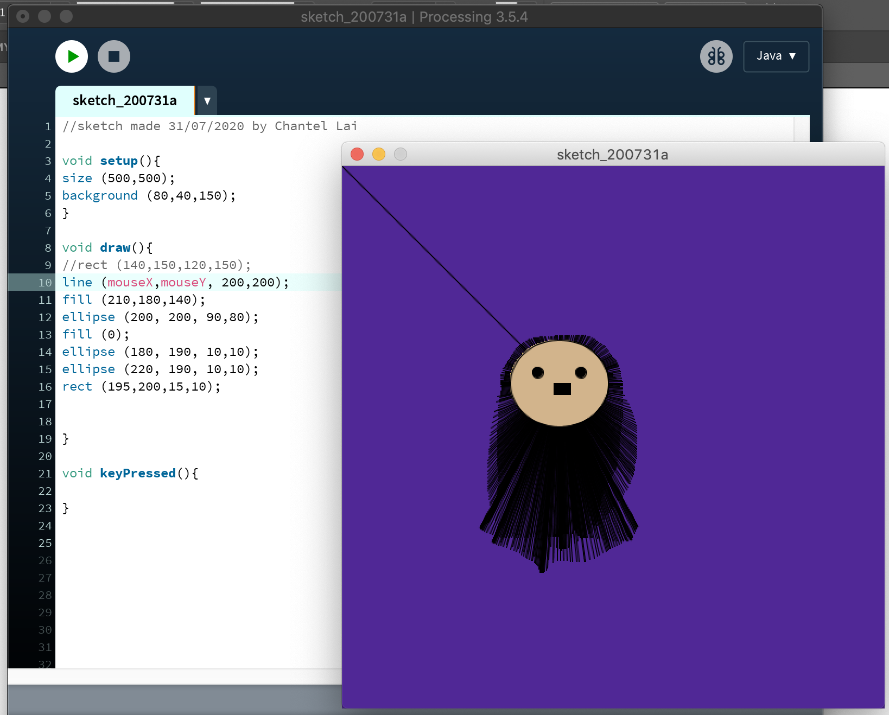
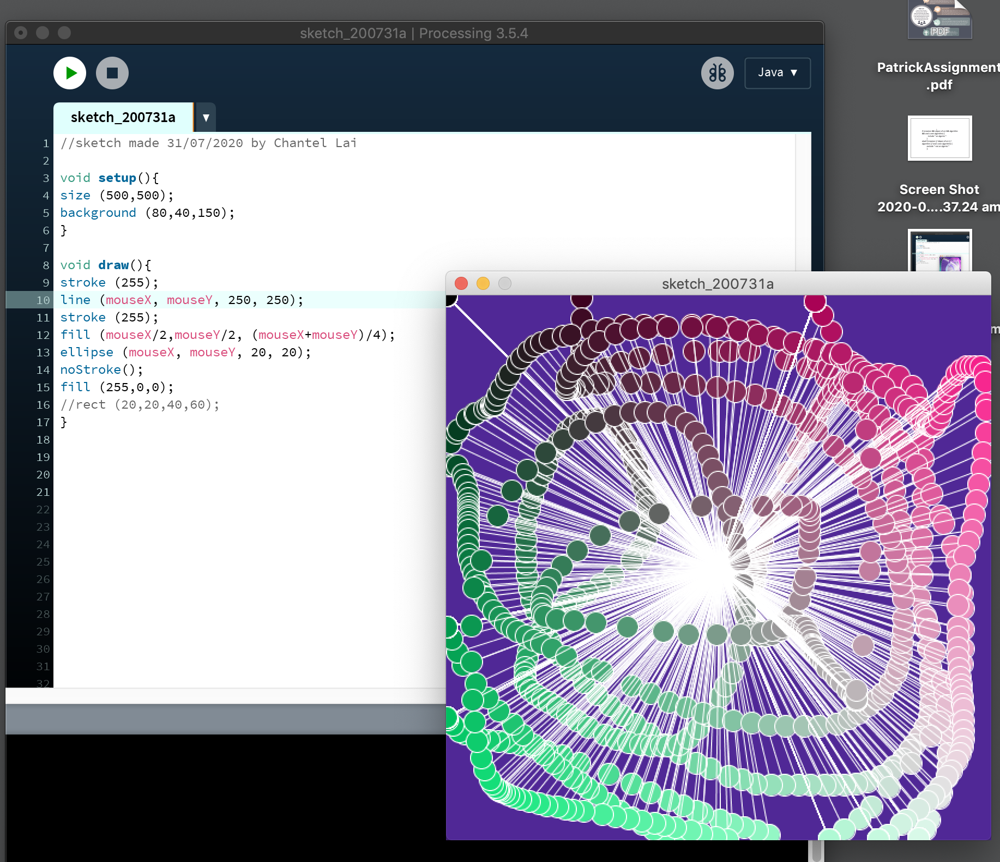

# Week 2 Processing

## In Class
In week 2, Karen had introduced Processing. She taught us the basics codes such as shapes and colours. At first it was very intimidating yet exciting as it was my first experience with coding. However, once getting the hang of things it was fun and exciting as there were so many possibilites that you could make just in Processing alone. It opened my mind to see a different side of the design world. 

As an activity, we had to make a self protrait of ourselves. I was dissapointed in the outcome of my self protrait aha. It look very bland and boring. However! a peer from class commented and said it looked like no face from spirited away which was nice. Remixing other peoples work really helped me to get used to Prcessing, such as moving different parts of the face that Karen taught us (mouseX, mouseY). 

## Research

Karen had also shown some artists that vary in generative design. Some designers that I have researched and enjoy their work are:
Ravon kwok  
Mark Dorf  
Tim Rodenbroeker  

I've researched each designers work to get a glimpse and understanding their style of generative design. This will also give me an understanding of what I would want to produce for my pitch and final project 

__Ravon Kwok__ 
'Algorithmic Menagerie'(http://ravenkwok.com/algorithmic_menagerie/) and '1194D^3'(http://ravenkwok.com/1194d3/) are the works that I find fascinating from Kwok. The use of geometric shapes to create geometric creatures 

__Mark Dorf__
'//Path 2012'(http://mdorf.com/path/) is the relationship between digital technology and connectivity. 
'Our personal devices are integrated into nearly every part of our lives affecting our social, emotional, and physical relationships. As technology translates and augments the human experience into a quantifiable, navigable, and cataloged language, we no longer log on or off, but rather create harmony living within the framework of technology and the Internet.'

__Tim Rodenbroeker__
'Flow'(https://timrodenbroeker.de/projects/flow/) is a 100% code-based abstract short-film, showing a worm-like figure floating through a three-dimensional space. It is based on a so called “visual score”, a graphic that defined the dramaturgy of the the film. 'After releasing the video i was wondering if it is possible to bring “Flow” with some interactivity to the web. Converting the code from Processing to Javascript forced me to rewrite many scenes from the video, but it basically worked.'

## Images
Self Protrait  

Experimental Processing  

