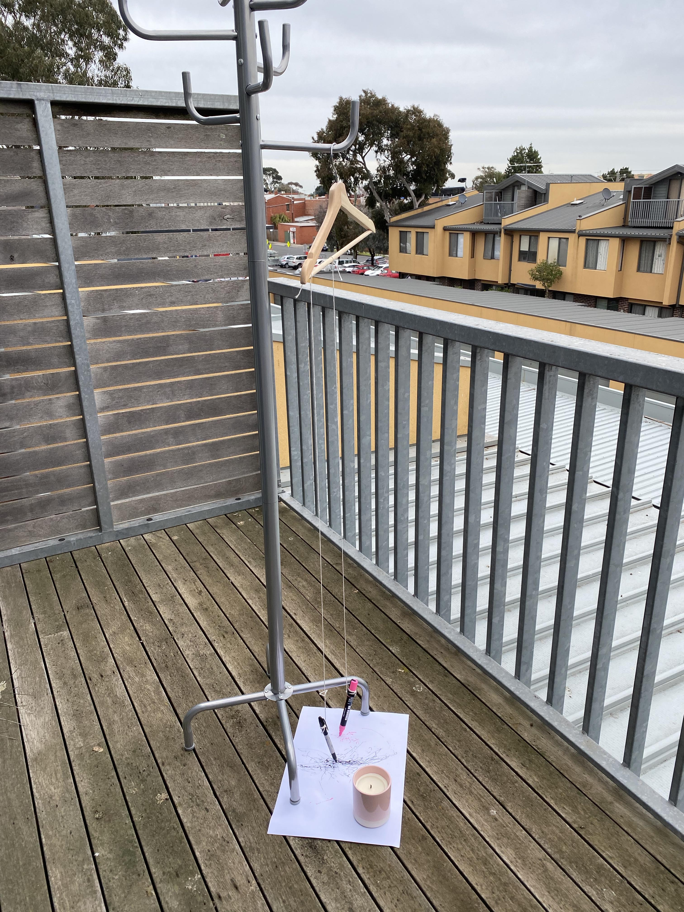

# Week 3 Non Human Machines 
## In Class 
In this week's class, we discussed about drawing machines and non human machines. Possibilities of working with animals, trees or wind as well as with natural forces such as gravity or centrifugal force to create non human drawing machines or systems. 

## Non Human Machine Activity 
At first when Karen was explaining the activity to create our own non human machines, I was planning on using my body and attaching a pen while walking around my house. However, I didn't have the tools to create a contraption on my body. Instead I gathered a coat stand and a coat hanger,attaching a sharpie with string to the coat hanger, outside on my balcony to use the force of the wind to move the sharpie on the paper. The first test I used one pen on an a4 sheet of paper. The second test I used two pens on a a3 sheet of paper. From this activity, the artwork it created is original, which you will not be able to replucate. The use of non human machines can create unique and original work within an algorithmic system. It can differ every time. 

## Research 

## Pitch Project 

## Images
Remix Self Protrait 

Test 1 of non human machine
 

Test 2 of non human machine

